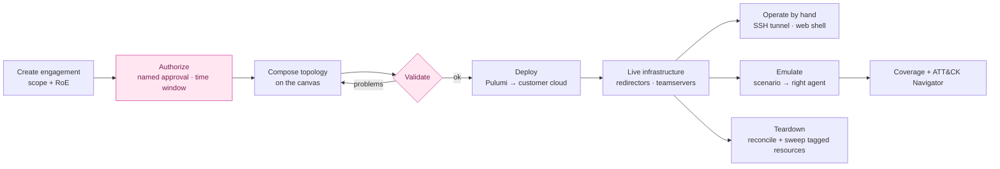
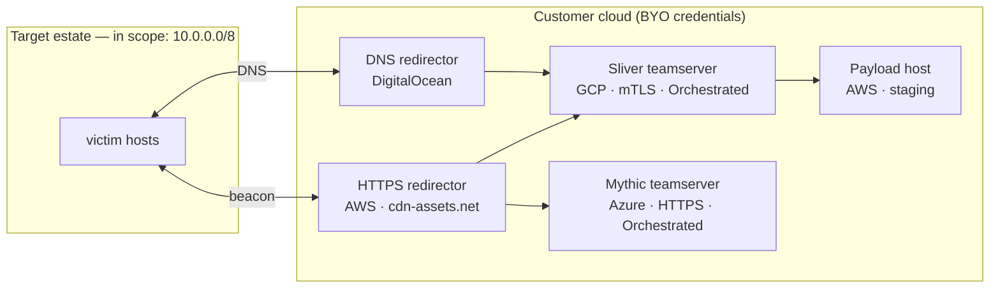
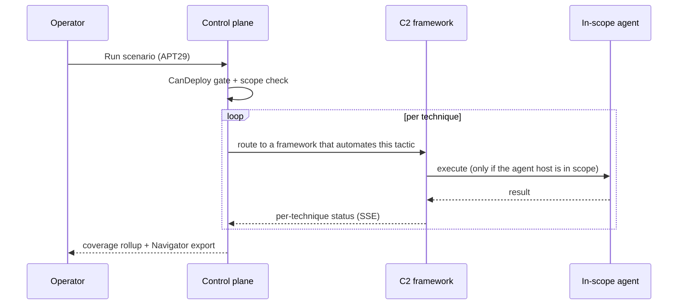

# RInfra

Enterprise red-team & purple-team operations platform. Visually compose attack
infrastructure across AWS, GCP, Azure, and DigitalOcean; deploy and front C2
frameworks (Sliver, Mythic, Havoc, Cobalt Strike, in-house); and run ATT&CK-mapped
adversary-emulation scenarios — all bound to authorized engagements with a full
audit trail.

> **Scope & posture.** RInfra *composes* existing, publicly available offensive
> tooling. It does not implement implants, payloads, exploits, or evasion. Every
> deploy is gated on an authorized engagement, provisions into the customer's own
> cloud account, and is fully audited. See `CLAUDE.md` for the invariants.

## Live demo

A fully interactive demo of the web console is published to GitHub Pages:

**→ https://berkotako.github.io/rinfra/**

It runs entirely in the browser on mock data (no backend, nothing provisioned),
so you can click through all five screens and the deploy / emulation flows. The
landing page includes a short "how to use" walkthrough. To run it locally
instead, see `web/README.md` (`make web-dev`).

> **One-time setup.** The demo deploys via the `Deploy demo to GitHub Pages`
> workflow, but GitHub Pages must be enabled by hand first:
> **Settings → Pages → Build and deployment → Source: "GitHub Actions"**.
> (The workflow token cannot enable Pages itself.) Note that **Pages on a
> private repo requires a paid GitHub plan** — on a free plan, make the repo
> public to use Pages. Once enabled, the demo publishes on every push to `main`,
> or on demand via the workflow's **Run workflow** button (pick this branch).

## How it works

RInfra turns a drag-and-drop canvas into real, authorized attack infrastructure
and runs ATT&CK-mapped emulation through it — every step gated and audited.
(The diagrams below are [Mermaid](https://mermaid.js.org/); GitHub renders them
inline.)

### The operator pipeline



Authorization (`CanDeploy`) and topology validation are hard gates: nothing is
provisioned for an unauthorized engagement or a malformed topology, and every
privileged action emits an append-only `audit.Event`.

### Example: attack infrastructure

A topology composed on the canvas, provisioned into the customer's own cloud
accounts (bring-your-own credentials), with redirectors fronting the C2
teamservers:



The operator never connects to a teamserver directly: manual access is delivered
over an SSH local-forward (`ssh -L`) or the in-browser **web shell**, both bound
to the engagement and audited.

### Example: a TTP and a scenario

Scenarios are authored once in a portable format (`domain.Technique`) and each
`Operator.Execute` adapter translates a technique to its framework's native
primitives. A single TTP carries a description, the procedure commands, and is
mapped to the C2s that can automate it by tactic:

```yaml
# T1003.001 — OS Credential Dumping: LSASS Memory   (tactic: credential-access)
description: Read LSASS process memory to extract credentials and tickets.
commands:
  - "rundll32 comsvcs.dll, MiniDump <lsass_pid> C:\\Windows\\Temp\\l.dmp full"
runs_on: [Sliver, Mythic, Metasploit, Havoc]   # auto; Cobalt Strike/Brute Ratel = manual
```

The **APT29** scenario chains TTPs across the kill chain; the emulation engine
routes each technique to a live C2 that can automate its tactic and an in-scope
agent:

| Tactic | Technique | Automated by |
|---|---|---|
| Initial Access | T1566.002 Spearphishing Link | manual (delivery) |
| Execution | T1059.001 PowerShell | Sliver · Mythic · Metasploit · Havoc |
| Persistence | T1547.001 Registry Run Keys | Sliver · Mythic · Metasploit · PoshC2 |
| Defense Evasion | T1055 Process Injection | Sliver · Mythic · Metasploit · Havoc |
| Credential Access | T1003.001 LSASS Memory | Sliver · Mythic · Metasploit |
| Discovery | T1018 Remote System Discovery | all orchestrated/scripted |
| Lateral Movement | T1021.001 RDP | Sliver · Mythic · Havoc · PoshC2 |
| Exfiltration | T1567.002 Exfil to Cloud Storage | Sliver · Mythic |



Fronted frameworks (Cobalt Strike, Brute Ratel) are provisioned and fronted but
operated by hand; orchestrated/scripted frameworks expose an `Operator` API the
engine drives. The **TTPs** screen shows the full library with per-technique C2
tags, and supports authoring your own (full CRUD).

## Layout

| Path | Purpose |
|------|---------|
| `cmd/rinfra-server` | Control-plane entrypoint |
| `internal/domain` | Core types (engagements, infrastructure, emulation) |
| `internal/cloud` | `CloudProvider` interface + per-provider adapters |
| `internal/c2` | `C2Provider`/`Operator` interfaces + per-framework adapters |
| `internal/emulation` | Scenario orchestrator |
| `internal/audit` | Append-only audit log |
| `internal/store` | Persistence interfaces (Postgres) |
| `migrations` | Database schema |
| `docs` | Architecture & support matrix |

## Getting started

### Docker (full stack — recommended)

A single script brings up the whole stack (Postgres + migrations + Go control
plane + web console) in Docker. It is safe to re-run on **every update** — it
rebuilds from the current checkout, re-applies migrations, and reuses the
secrets it generated the first time:

```bash
scripts/install.sh            # build + start everything
scripts/install.sh --pull     # update to latest, then rebuild + restart
scripts/install.sh --down     # stop the stack
scripts/install.sh --fresh    # wipe the Postgres volume (DESTRUCTIVE)
```

Then open:

| Service | URL |
|---------|-----|
| Web console | http://localhost:3000 |
| Control plane | http://localhost:8080 (`GET /healthz`) |

The console requires sign-in. The Docker stack seeds **`admin` / `admin`** on a
fresh install (via `RINFRA_ADMIN_PASSWORD`, default `admin` in
`docker-compose.yml`) — **change it immediately** under **Settings → Account**,
or set `RINFRA_ADMIN_PASSWORD` to your own value before first boot. (The server
binary itself never defaults to `admin/admin` in production; see Authentication
below.) Cloud provider
keys (AWS / GCP / Azure / DigitalOcean) are added under **Settings → Cloud
credentials**; they are stored encrypted and bound to a single engagement
(bring-your-own cloud, never RInfra's tenancy).

The install script generates `RINFRA_MASTER_KEY` into a local `.env` (see
`.env.example`). Live cloud provisioning additionally needs the Pulumi CLI;
see `cmd/rinfra-server` docs and `docs/RUNBOOK_DO.md`.

## Authentication, roles & projects

The control plane authenticates operators with bearer-token sessions and three
roles. On first boot, if no users exist, a bootstrap admin is seeded:

- **Dev mode (`RINFRA_DEV=1`)** seeds **`admin` / `admin`** (change it
  immediately — for local use only).
- **Production** seeds `admin` with the password from **`RINFRA_ADMIN_PASSWORD`**.
  If that variable is unset, **no admin is created** (the server never boots with
  `admin/admin` in production); set it to bootstrap the first admin, then change
  it after first login.

The server also refuses to start in production with authentication disabled, and
allowed CORS origins are configurable via **`RINFRA_CORS_ORIGINS`**
(comma-separated; defaults to the dev frontend `http://localhost:3000`; `*`
reflects any Origin).

| Role | Capabilities |
|------|--------------|
| `admin` | Everything: manage all users, projects, and engagements. |
| `lead` | Owns operators and projects; creates operator accounts, creates/manages their own projects, and binds operators to them. |
| `operator` | Works within the projects they are assigned to. |

A **project** groups one or more **engagements** (which carry the infrastructure
and emulations). Access flows from role + project membership: admins see all;
leads see the projects they lead; operators see the projects they're a member of.

Key endpoints (all under `/api/v1`, bearer token required except `auth/login`):
`POST auth/login` · `POST auth/logout` · `GET auth/me` · `users` (CRUD) ·
`projects` (CRUD) + `projects/{id}/members` + `projects/{id}/engagements`.
Auth is enforced when the server wires the auth subsystem; the test suite runs
it disabled (legacy operator-header identity) to stay hermetic.

### Local (Go only)

```bash
go build ./...
go vet ./...
make test-unit-light         # fast inner-loop tests (skips heavy Pulumi provider SDKs)
make test-cloud              # provider tests (compiles Pulumi AWS/Azure/GCP/DO SDKs — slow)
make test                    # full suite
go run ./cmd/rinfra-server   # serves :8080, logs registered C2 tiers
```

The frontend (Next.js + React Flow drag-and-drop canvas) lives under `web/` and
talks to this control plane over REST/JSON (`make web-dev`, or `make dev`).

## Build order

See `CLAUDE.md` → "Build order". Summary: domain+store → audit → cloud
(DigitalOcean first) → orchestration → C2 (Sliver/Mythic first) → emulation.
Validation/reporting is deferred.
